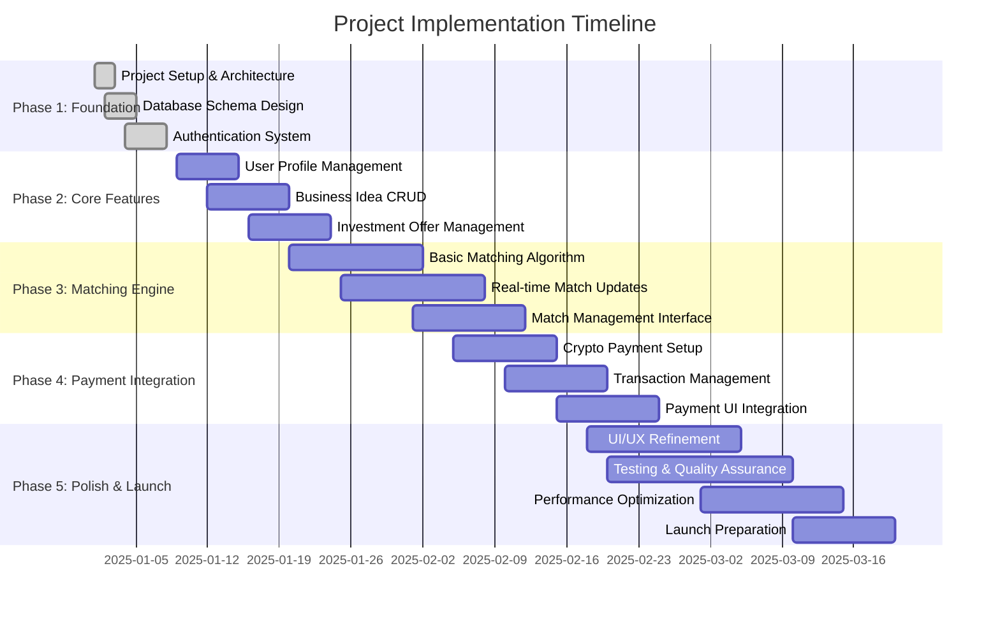

# Implementation Roadmap

## Project Timeline Overview

**Total Duration**: 10-12 weeks
**Target Launch**: Small startup MVP for 100-500 users
**Core Focus**: Matching algorithm functionality



## Detailed Phase Breakdown

### Phase 1: Foundation (Days 1-8)
**Objective**: Establish solid technical foundation

#### Week 1: Project Setup & Architecture
- [x] Set up Next.js project with TypeScript
- [x] Configure Tailwind CSS and Shadcn UI
- [x] Initialize Convex backend
- [x] Set up development environment and tooling
- [x] Create project documentation structure

#### Week 1-2: Database Schema & Authentication
- [x] Design and implement core database schema
- [x] Set up Convex database with proper indexing
- [x] Implement user authentication system
- [x] Create user registration and login flows
- [x] Set up email verification and password reset

**Milestone**: Working authentication system with database connectivity

### Phase 2: Core Features (Days 9-24)
**Objective**: Build essential user-facing functionality

#### Week 2: User Profile Management
- [ ] Create user profile creation and editing interfaces
- [ ] Implement profile verification system
- [ ] Add support for both creator and investor profile types
- [ ] Create profile browsing and search functionality
- [ ] Implement avatar upload and media management

#### Week 3: Business Idea Management
- [ ] Build business idea creation form with rich text editor
- [ ] Implement idea categories and tagging system
- [ ] Create idea listing and filtering interface
- [ ] Add image/document upload for idea presentations
- [ ] Implement idea status management (draft/published)

#### Week 3-4: Investment Offer Management
- [ ] Create investment offer creation interface
- [ ] Implement investment criteria specification
- [ ] Build offer browsing and filtering system
- [ ] Add offer activation/deactivation functionality

**Milestone**: Complete CRUD operations for users, ideas, and investment offers

### Phase 3: Matching Engine (Days 20-40)
**Objective**: Implement core matching functionality (Priority Feature)

#### Week 4-5: Basic Matching Algorithm
- [ ] Implement financial compatibility scoring
- [ ] Add industry and category alignment logic
- [ ] Create basic risk tolerance matching
- [ ] Build match calculation engine in Convex
- [ ] Implement match storage and retrieval

#### Week 5-6: Advanced Matching Features
- [ ] Add geographic and timeline compatibility
- [ ] Implement qualitative factor analysis
- [ ] Create real-time match updates using Convex
- [ ] Build match notification system
- [ ] Add match feedback and rating system

#### Week 6-7: Match Management Interface
- [ ] Create match discovery dashboard
- [ ] Build match detail and interaction interface
- [ ] Implement match status tracking
- [ ] Add communication features between matched users
- [ ] Create match analytics and reporting

**Milestone**: Fully functional matching system with real-time updates

### Phase 4: Payment Integration (Days 35-55)
**Objective**: Enable secure crypto transactions

#### Week 7-8: Crypto Payment Infrastructure
- [ ] Research and select crypto payment provider (Coinbase Commerce or Stripe Crypto)
- [ ] Set up payment provider accounts and API keys
- [ ] Implement payment intent creation in Convex
- [ ] Create secure payment processing functions
- [ ] Add payment webhook handling

#### Week 8-9: Transaction Management
- [ ] Build transaction record management
- [ ] Implement escrow-like functionality for security
- [ ] Create transaction status tracking
- [ ] Add crypto wallet address validation
- [ ] Implement transaction history and receipts

#### Week 9: Payment UI Integration
- [ ] Create payment initiation interface
- [ ] Build crypto wallet connection functionality
- [ ] Implement payment confirmation flows
- [ ] Add transaction success/failure handling
- [ ] Create payment analytics dashboard

**Milestone**: End-to-end crypto payment functionality

### Phase 5: Polish & Launch (Days 50-75)
**Objective**: Refine user experience and prepare for launch

#### Week 9-10: UI/UX Refinement
- [ ] Conduct user interface consistency audit
- [ ] Optimize responsive design for mobile devices
- [ ] Improve loading states and error handling
- [ ] Add accessibility features (WCAG compliance)
- [ ] Implement dark/light theme support

#### Week 10-11: Testing & Quality Assurance
- [ ] Write comprehensive unit tests for matching algorithm
- [ ] Conduct integration testing for payment flows
- [ ] Perform user acceptance testing
- [ ] Implement error monitoring and logging
- [ ] Conduct security audit of payment system

#### Week 11-12: Performance Optimization
- [ ] Optimize database queries for matching performance
- [ ] Implement caching strategies for frequently accessed data
- [ ] Conduct load testing for expected user volumes
- [ ] Optimize image and asset delivery
- [ ] Set up monitoring and analytics

#### Week 12: Launch Preparation
- [ ] Set up production deployment environment
- [ ] Configure domain and SSL certificates
- [ ] Set up monitoring and alerting systems
- [ ] Create user onboarding and help documentation
- [ ] Plan initial user acquisition strategy

**Milestone**: Production-ready application with comprehensive testing

## Technical Stack Implementation Details

### Frontend Implementation (Next.js + Tailwind + Shadcn)
```bash
# Project initialization
npx create-next-app@latest business-matchmaking --typescript --tailwind --eslint --app
cd business-matchmaking
npx shadcn-ui@latest init

# Key dependencies to install
npm install convex zod react-hook-form @hookform/resolvers lucide-react
npm install @coinbase/commerce (or stripe for crypto payments)
```

### Backend Implementation (Convex)
```typescript
// Core Convex setup
import { v } from "convex/values";

export const createUser = mutation({
  args: {
    email: v.string(),
    name: v.string(),
    userType: v.union(v.literal("creator"), v.literal("investor")),
  },
  handler: async (ctx, args) => {
    // User creation logic
  },
});
```

## Risk Mitigation Strategies

### Technical Risks
1. **Matching Algorithm Performance**
   - Start with simplified scoring for quick implementation
   - Implement caching for expensive calculations
   - Add performance monitoring and alerting

2. **Payment Integration Complexity**
   - Choose established, well-documented payment providers
   - Implement comprehensive error handling and rollback mechanisms
   - Start with testnet/sandbox environments

3. **Real-time Feature Scalability**
   - Use Convex's built-in real-time capabilities
   - Implement proper indexing for database queries
   - Add rate limiting for real-time updates

### Business Risks
1. **Market Validation**
   - Focus on core matching as primary differentiator
   - Implement feedback systems to iterate quickly
   - Plan for pivots based on user behavior

2. **User Acquisition**
   - Build comprehensive onboarding flow
   - Implement referral system for organic growth
   - Create clear value proposition for both user types

## Success Criteria & Metrics

### Phase 1 Success Criteria
- [ ] Authentication system working with <2s response time
- [ ] Database schema supports all core entities
- [ ] Development environment fully configured

### Phase 2 Success Criteria
- [ ] All CRUD operations functional and tested
- [ ] User profiles complete with media upload
- [ ] Basic search and filtering working

### Phase 3 Success Criteria (Priority)
- [ ] Matching algorithm produces relevant suggestions
- [ ] Real-time updates working smoothly
- [ ] Match feedback system implemented
- [ ] Average match calculation time <200ms

### Phase 4 Success Criteria
- [ ] Crypto payments processing correctly
- [ ] Transaction security verified
- [ ] Payment UI integrated seamlessly

### Phase 5 Success Criteria
- [ ] Application loads in <2s on average
- [ ] All major browsers supported
- [ ] Mobile responsiveness verified
- [ ] User acceptance testing passed

## Key Dependencies & Prerequisites

### Development Prerequisites
- Node.js 18+ and npm/yarn
- Convex account and CLI
- Payment provider account (Coinbase Commerce or Stripe)
- Cloud storage for file uploads
- Email service for notifications

### External Service Setup
1. **Convex Setup**
   - Create Convex project
   - Configure environment variables
   - Set up database schema

2. **Payment Provider**
   - Create merchant account
   - Generate API keys
   - Configure webhooks

3. **Deployment Platform**
   - Set up Vercel account
   - Configure domain and SSL
   - Set up deployment pipeline

## Recommended Team Structure

For a 10-12 week timeline, consider this team composition:

### Core Team
- **Full-Stack Developer**: Handles both frontend and backend implementation
- **UI/UX Designer**: Focuses on user experience and visual design
- **Product Manager**: Manages requirements and prioritizes features

### Extended Team (As Needed)
- **DevOps Engineer**: Handles deployment and infrastructure
- **Security Consultant**: Reviews payment and data security
- **QA Tester**: Conducts comprehensive testing

## Next Steps After Planning

1. **Finalize Technical Stack**: Choose specific versions and payment providers
2. **Set Up Development Environment**: Initialize project and configure tools
3. **Begin Implementation**: Start with Phase 1 foundation work
4. **Regular Reviews**: Weekly check-ins to assess progress and adjust plans
5. **User Feedback Integration**: Plan for early user testing and iteration

This roadmap provides a structured approach to building your business idea-investment matchmaking platform while maintaining flexibility to adapt based on technical challenges and market feedback.