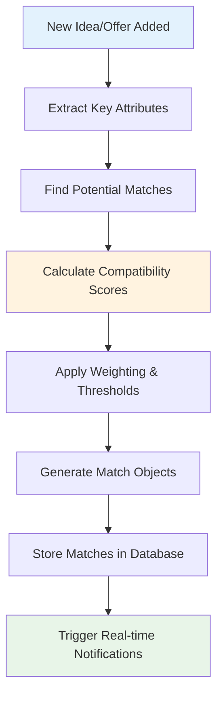
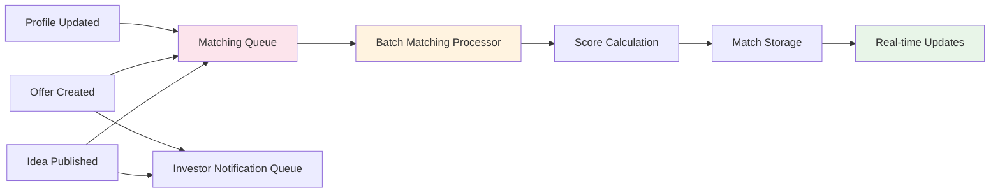

# Matching Algorithm Architecture

## Overview

The matching algorithm is the core differentiator of the platform, designed to intelligently connect business idea creators with suitable investors based on multiple compatibility factors. The algorithm uses a multi-criteria scoring system to ensure high-quality, relevant matches.

## Algorithm Design Principles

### 1. Multi-Dimensional Matching
The algorithm evaluates matches across multiple dimensions to ensure comprehensive compatibility assessment.

### 2. Real-Time Processing
Matches are calculated and updated in real-time as new ideas or investment offers are added.

### 3. Scalable Architecture
Designed to handle growing numbers of users and content while maintaining performance.

### 4. Configurable Weighting
Matching factors can be adjusted based on user feedback and market insights.

## Matching Criteria & Scoring System

### Core Matching Factors

#### 1. Financial Compatibility (Weight: 30%)
```typescript
interface FinancialMatch {
  // Investment amount alignment
  amountScore: number; // 0-100

  // Equity expectations alignment
  equityScore: number; // 0-100

  // Investment stage preference
  stageScore: number; // 0-100
}
```

**Scoring Logic:**
- **Amount Score**: Calculated based on overlap between investor's range and idea's funding goal
- **Equity Score**: Alignment between offered equity and investor's expectations
- **Stage Score**: Match between idea's development stage and investor's preferences

#### 2. Industry & Category Alignment (Weight: 25%)
```typescript
interface IndustryMatch {
  // Primary category match
  primaryCategoryScore: number; // 0-100

  // Tag similarity
  tagSimilarityScore: number; // 0-100

  // Market trend alignment
  marketTrendScore: number; // 0-100
}
```

**Scoring Logic:**
- **Primary Category**: Exact match = 100, related category = 60, unrelated = 0
- **Tag Similarity**: Jaccard similarity coefficient between idea tags and investor preferences
- **Market Trends**: Alignment with current market opportunities and investor focus areas

#### 3. Risk Tolerance Alignment (Weight: 20%)
```typescript
interface RiskMatch {
  // Risk profile compatibility
  riskToleranceScore: number; // 0-100

  // Experience level alignment
  experienceScore: number; // 0-100

  // Track record consideration
  trackRecordScore: number; // 0-100
}
```

**Scoring Logic:**
- **Risk Tolerance**: Direct mapping between creator's risk profile and investor's tolerance
- **Experience**: Alignment of team experience with investor's expectations
- **Track Record**: Consideration of both parties' past performance

#### 4. Geographic & Timeline Compatibility (Weight: 15%)
```typescript
interface CompatibilityMatch {
  // Location preferences
  locationScore: number; // 0-100

  // Timeline alignment
  timelineScore: number; // 0-100

  // Cultural fit indicators
  culturalFitScore: number; // 0-100
}
```

#### 5. Qualitative Factors (Weight: 10%)
```typescript
interface QualitativeMatch {
  // Description quality
  descriptionScore: number; // 0-100

  // Presentation completeness
  completenessScore: number; // 0-100

  // Team presentation
  teamPresentationScore: number; // 0-100
}
```

## Algorithm Workflow

### 1. Match Detection Process



### 2. Scoring Algorithm Implementation

```typescript
interface MatchCalculationInput {
  idea: BusinessIdea;
  investor: InvestmentOffer;
  userProfiles: UserProfiles;
}

interface MatchResult {
  matchId: string;
  totalScore: number;
  factorScores: {
    financial: number;
    industry: number;
    risk: number;
    compatibility: number;
    qualitative: number;
  };
  confidence: number;
  reasoning: string[];
}

function calculateMatch(input: MatchCalculationInput): MatchResult {
  const { idea, investor, userProfiles } = input;

  // Calculate individual factor scores
  const financialScore = calculateFinancialMatch(idea, investor);
  const industryScore = calculateIndustryMatch(idea, investor);
  const riskScore = calculateRiskMatch(idea, userProfiles);
  const compatibilityScore = calculateCompatibilityMatch(idea, investor, userProfiles);
  const qualitativeScore = calculateQualitativeMatch(idea);

  // Apply weights and calculate total
  const weights = { financial: 0.3, industry: 0.25, risk: 0.2, compatibility: 0.15, qualitative: 0.1 };
  const totalScore = (
    financialScore * weights.financial +
    industryScore * weights.industry +
    riskScore * weights.risk +
    compatibilityScore * weights.compatibility +
    qualitativeScore * weights.qualitative
  );

  // Generate reasoning
  const reasoning = generateMatchReasoning({
    financialScore,
    industryScore,
    riskScore,
    compatibilityScore,
    qualitativeScore
  });

  return {
    matchId: generateMatchId(idea.id, investor.id),
    totalScore,
    factorScores: {
      financial: financialScore,
      industry: industryScore,
      risk: riskScore,
      compatibility: compatibilityScore,
      qualitative: qualitativeScore
    },
    confidence: calculateConfidence(totalScore, factorScores),
    reasoning
  };
}
```

## Real-Time Matching System

### Trigger-Based Matching

#### 1. Event-Driven Architecture


#### 2. Matching Queue System
- **Redis-based Queue**: For handling high-volume matching requests
- **Batch Processing**: Process multiple matches simultaneously for efficiency
- **Priority Queue**: Prioritize high-potential matches

### 3. Performance Optimization Strategies

#### Database Query Optimization
```sql
-- Optimized query for finding potential matches
SELECT investor_id, investment_offers.*
FROM investment_offers
WHERE is_active = true
  AND amount_range_min <= $1 -- idea funding goal
  AND amount_range_max >= $1
  AND preferred_industries && $2 -- overlaps with idea categories
  AND preferred_stages @> ARRAY[$3] -- contains idea stage
```

#### Caching Strategy
- **Hot Data Caching**: Frequently accessed user profiles and active offers
- **Match Result Caching**: Cache recent match calculations for 24 hours
- **Negative Caching**: Cache "no match" results to avoid redundant calculations

## Machine Learning Enhancement Strategy

### Phase 1: Rule-Based Matching (Initial Implementation)
- Simple, explainable matching rules
- Fast computation and easy debugging
- Transparent reasoning for users

### Phase 2: ML-Augmented Matching (Future Enhancement)
```typescript
interface MLFeatures {
  // User behavior features
  userEngagementScore: number;
  responseTimePatterns: number[];

  // Content features
  ideaCompletenessScore: number;
  descriptionSentiment: number;

  // Historical features
  pastMatchSuccessRate: number;
  userFeedbackScores: number[];
}

interface MLMatchModel {
  features: MLFeatures;
  predictedSuccessScore: number;
  confidenceInterval: [number, number];
}
```

### Potential ML Applications
1. **Success Prediction**: Predict likelihood of match leading to investment
2. **User Preference Learning**: Learn from user interactions to improve future matches
3. **Content Quality Scoring**: Automatically assess idea presentation quality
4. **Fraud Detection**: Identify potentially fraudulent or low-quality submissions

## Match Quality Assurance

### 1. Threshold Management
- **Minimum Score Threshold**: Only show matches above 60% compatibility
- **Dynamic Thresholds**: Adjust based on market activity and user feedback
- **Quality Gates**: Manual review for exceptionally high-value opportunities

### 2. Feedback Loop Integration
```typescript
interface MatchFeedback {
  matchId: string;
  userId: string;
  feedbackType: 'positive' | 'neutral' | 'negative';
  comments?: string;
  timestamp: Date;
}

function processMatchFeedback(feedback: MatchFeedback[]) {
  // Analyze feedback patterns
  // Adjust matching weights if needed
  // Identify users with consistently poor match quality
  // Improve algorithm based on collective feedback
}
```

## Performance Metrics & Monitoring

### Key Performance Indicators
- **Match Accuracy**: Percentage of matches that lead to meaningful interactions
- **Response Rate**: How often users engage with suggested matches
- **Conversion Rate**: Percentage of matches that result in investments
- **Algorithm Speed**: Average time to generate match suggestions
- **User Satisfaction**: Feedback scores on match quality

### Monitoring Dashboard
- Real-time algorithm performance metrics
- Match quality trends over time
- User engagement analytics
- System performance indicators

## Implementation Strategy

### Phase 1: Basic Matching (Week 1-2)
- Implement core financial and industry matching
- Simple scoring algorithm
- Basic match storage and retrieval

### Phase 2: Enhanced Matching (Week 3-4)
- Add risk tolerance and compatibility factors
- Implement real-time matching
- Add match feedback system

### Phase 3: Advanced Features (Week 5-6)
- Qualitative factor analysis
- Performance optimization
- Advanced caching strategies

### Phase 4: ML Integration (Future)
- Collect match feedback data
- Implement basic ML models
- A/B testing of algorithm improvements

This matching algorithm architecture provides a solid foundation for connecting business ideas with suitable investors while maintaining the flexibility to evolve and improve based on user feedback and market dynamics.