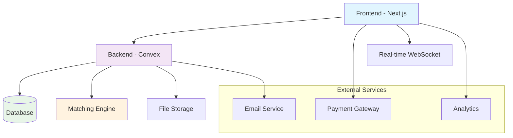
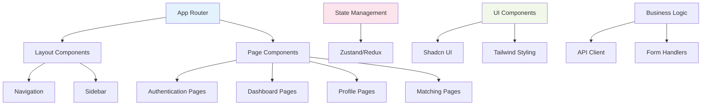
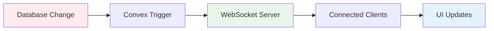
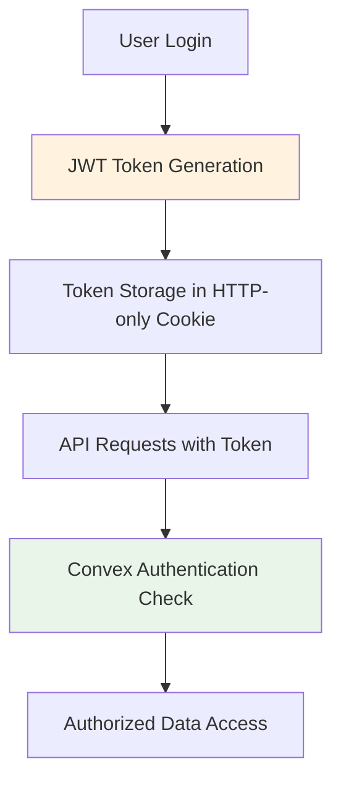

# System Architecture & Data Models

## High-Level System Architecture



## Component Architecture

### Frontend Architecture (Next.js)


## Database Schema Design

### Core Entities

#### 1. User Model
```typescript
interface User {
  id: string;
  email: string;
  name: string;
  avatar?: string;
  userType: 'creator' | 'investor';
  isVerified: boolean;
  createdAt: Date;
  updatedAt: Date;

  // Creator specific fields
  companyName?: string;
  industry?: string;
  experience?: string;

  // Investor specific fields
  investmentRange?: {
    min: number;
    max: number;
  };
  preferredIndustries?: string[];
  riskTolerance?: 'low' | 'medium' | 'high';

  // Common fields
  bio?: string;
  location?: string;
  website?: string;
  socialLinks?: {
    linkedin?: string;
    twitter?: string;
  };
}
```

#### 2. Business Idea Model
```typescript
interface BusinessIdea {
  id: string;
  creatorId: string;
  title: string;
  description: string;
  category: string;
  tags: string[];

  // Financial details
  fundingGoal: number;
  currentFunding: number;
  equityOffered: number;
  valuation?: number;

  // Project details
  stage: 'concept' | 'mvp' | 'early' | 'growth';
  timeline: string;
  teamSize?: number;

  // Media
  images?: string[];
  documents?: string[];
  videoUrl?: string;

  // Status
  status: 'draft' | 'published' | 'funded' | 'cancelled';
  createdAt: Date;
  updatedAt: Date;
}
```

#### 3. Investment Offer Model
```typescript
interface InvestmentOffer {
  id: string;
  investorId: string;
  title: string;
  description: string;

  // Investment details
  amountRange: {
    min: number;
    max: number;
  };
  preferredEquity: {
    min: number;
    max: number;
  };

  // Preferences
  preferredStages: string[];
  preferredIndustries: string[];
  geographicPreference?: string;

  // Terms
  investmentType: 'equity' | 'debt' | 'convertible';
  timeline?: string;

  // Status
  isActive: boolean;
  createdAt: Date;
  updatedAt: Date;
}
```

#### 4. Match Model
```typescript
interface Match {
  id: string;
  ideaId: string;
  investorId: string;
  creatorId: string;

  // Match details
  matchScore: number;
  matchingFactors: {
    amountCompatibility: number;
    industryAlignment: number;
    stagePreference: number;
    riskAlignment: number;
  };

  // Status
  status: 'suggested' | 'viewed' | 'contacted' | 'negotiating' | 'invested' | 'rejected';

  // Communication
  messages?: Message[];
  createdAt: Date;
  updatedAt: Date;
}
```

#### 5. Transaction Model
```typescript
interface Transaction {
  id: string;
  matchId: string;
  investorId: string;
  creatorId: string;

  // Transaction details
  amount: number;
  currency: string;
  cryptoTxHash?: string;

  // Status
  status: 'pending' | 'confirmed' | 'completed' | 'failed' | 'refunded';

  // Payment method
  paymentMethod: 'crypto' | 'bank_transfer';
  walletAddress?: string;

  createdAt: Date;
  confirmedAt?: Date;
}
```

## API Architecture

### RESTful API Endpoints

#### Authentication Endpoints
```
POST   /api/auth/signup
POST   /api/auth/login
POST   /api/auth/logout
GET    /api/auth/me
POST   /api/auth/verify-email
```

#### User Management
```
GET    /api/users/profile
PUT    /api/users/profile
GET    /api/users/:id
POST   /api/users/upload-avatar
```

#### Business Ideas
```
GET    /api/ideas - List all ideas (with filters)
POST   /api/ideas - Create new idea
GET    /api/ideas/:id - Get specific idea
PUT    /api/ideas/:id - Update idea
DELETE /api/ideas/:id - Delete idea
GET    /api/ideas/:id/matches - Get matches for idea
```

#### Investment Offers
```
GET    /api/offers - List all offers (with filters)
POST   /api/offers - Create new offer
GET    /api/offers/:id - Get specific offer
PUT    /api/offers/:id - Update offer
DELETE /api/offers/:id - Delete offer
```

#### Matching System
```
GET    /api/matches - Get user's matches
GET    /api/matches/suggestions - Get match suggestions
POST   /api/matches/:id/contact - Contact match
PUT    /api/matches/:id/status - Update match status
```

#### Payment System
```
POST   /api/payments/create-intent
GET    /api/payments/:id/status
POST   /api/payments/webhook - Handle payment webhooks
```

## Real-time Architecture

### WebSocket Events

#### Match Events
```
MATCH_SUGGESTED - New match suggestion available
MATCH_UPDATED - Match status or details changed
MATCH_MESSAGE - New message in match conversation
```

#### User Events
```
USER_ONLINE - User comes online
USER_OFFLINE - User goes offline
IDEA_PUBLISHED - New business idea published
OFFER_CREATED - New investment offer created
```

### Real-time Data Flow


## File Storage Architecture

### File Organization
```
/uploads/
  /avatars/{userId}/profile.jpg
  /ideas/{ideaId}/
    /gallery/image1.jpg
    /documents/pitch-deck.pdf
  /transactions/{transactionId}/receipts/
```

### Storage Strategy
- **Profile Images**: Compressed and optimized for web
- **Idea Assets**: Multiple sizes generated for responsive display
- **Documents**: Secure access with time-limited URLs
- **Backups**: Automated daily backups with encryption

## Security Architecture

### Authentication Flow


### Security Measures
- **Data Encryption**: All sensitive data encrypted at rest
- **API Security**: JWT tokens with short expiration
- **Rate Limiting**: API endpoint protection
- **Input Validation**: Comprehensive sanitization
- **CORS Protection**: Proper cross-origin policies

## Scalability Considerations

### Database Optimization
- **Indexing Strategy**: Optimized indexes for matching queries
- **Query Performance**: Efficient queries for real-time matching
- **Caching**: Redis for frequently accessed data

### Application Scaling
- **Horizontal Scaling**: Stateless application design
- **CDN Integration**: Static asset delivery
- **Database Scaling**: Convex auto-scaling capabilities

This architecture provides a solid foundation for the business idea-investment matchmaking platform while maintaining flexibility for future enhancements and scaling.